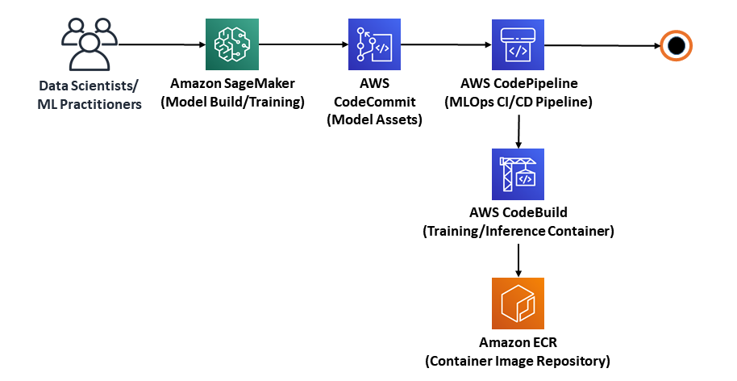

# MLPipeline-on-AWS

In this tutorial, I will explain how to build an MLOps pipeline that leverages Amazon SageMaker for ML model development. We will add different AWS DevOps tools and services to create an automated CI/CD pipeline for the ML model. This pipeline will prepare the data, build our docker images, train and test the ML model, and then integrate the model into a production workload.

We will be answer three basic questions to develop a ML model for a real Business Case:
1. Can we build, test and deploy models in a repeatable, reliable and automated way?
2. How can we account for model concept drift in production?
3. How long would it take our organization to deploy a change that involves a single line of code?

## Getting Started: Architecture
We will be creating a basic CI/CD pipeline as shown below:

The process flow steps for the pipeline are as follows:
    1. Collect dataset in S3 bucket or Update the source code in CodeCommit / Github
    2. CodePipeline checks for changes in S3/CodeCommit and triggers the Lambda function for ETL pipeline
        1. The Lambda function calls Glue Job to perfrom pre-processing and feature engineering tasks
    3. CodePipeline calls another Lambda function to start model training using SageMaker and enables CloudWatch to monitor training
    4. If the training fails, then the pipeline stops and else if the model training is successful then CodePipeline waits for CloudFormation to deploy trained model into **Development Environment** as SageMaker endpoint.
    5. After the deployment in **Development Environment**, CodePipeline execute automated test workflow to evaluate and ensure that the model meets the quality acceptance criteria.
    6. If the model passes the quality criteria, then CloudFormation deploys the model into production. The endpoint will deploy with an AutoScaling policy for model HA and Elasticity. Additionally, the endpoint has Data Capturing enabled to monitor the quality of the production model.

## Contact
Brijesh Modasara (kraken2404@gmail.com)

## License
© Brijesh Modasara
